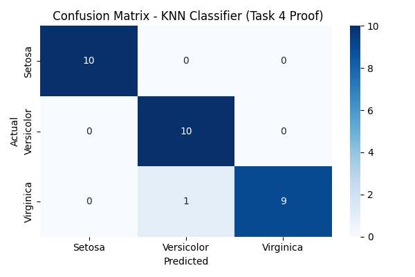

#  Iris Flower Classification using K-Nearest Neighbors (KNN)

>  **Internship Task 6 – Distance-Based ML Model**  
>  **Submitted by:** Tirtha Dutta  
>  **Model Type:** Multiclass Classification | Supervised Learning  

---

##  Objective

Build and evaluate a **K-Nearest Neighbors (KNN)** model to classify species of iris flowers using petal and sepal measurements. This project demonstrates an end-to-end ML workflow from preprocessing to model evaluation — as part of a professional internship submission.

---

##  Dataset

- **Source:** [Iris Dataset – Kaggle](https://www.kaggle.com/datasets/uciml/iris)  
- **Target Classes:**  
  - `Iris-setosa`  
  - `Iris-versicolor`  
  - `Iris-virginica`  
- **Shape:** `150 rows × 5 columns`  
- **Target Column:** `Species`

---

##  Workflow Summary

### 1️ Data Cleaning
- Dropped unnecessary `Id` column
- Verified **no null/missing values**

### 2️ Label Encoding & Feature Scaling
- Converted species labels to numbers using `LabelEncoder`
- Scaled all features using `StandardScaler` (important for KNN)

### 3️ Model Building: KNN Classifier
- Trained multiple KNN models with different `k` values (1 to 15)
- Selected **best k = 11** based on highest accuracy

### 4️ Evaluation Metrics
- Accuracy score
- Confusion matrix
- Classification report

---

##  Final Results (K = 11)

| Metric    | Value     |
|-----------|-----------|
| Accuracy  | 96.67%    |
| Best `k`  | 11        |
| Classes   | 3         |

---

##  Confusion Matrix

 Stored in: `images/confusion_matrix.png`

---

##  Tools & Libraries Used

- **Language:** Python  
- **Libraries:** `pandas`, `numpy`, `scikit-learn`, `matplotlib`, `seaborn`  
- **Environment:** Jupyter Notebook  

---

##  Skills Demonstrated

- Distance-based classification (KNN)
- Feature scaling and label encoding
- Model selection using accuracy
- Visualization and interpretation of results
- Complete end-to-end ML pipeline
- GitHub-based ML project documentation

---

##  Conclusion

This project shows how even a simple algorithm like KNN can achieve high accuracy with proper preprocessing and evaluation. It is a clean, practical example of supervised learning applied to a real-world dataset — suitable for internship evaluation, resume building, or portfolio showcase.

---
